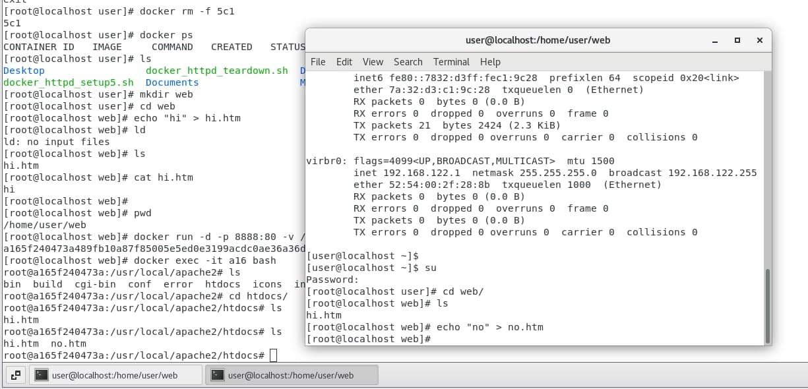

## Docker

## image
image新增docker進行任何動作都會產生layer
如果沒有作儲存的動作產生的layer都會消失

新增hi.txt
```
[root@localhost user]# docker run -it ubuntu bash
root@3fd4bba31a41:/# cd /home
root@3fd4bba31a41:/home# echo "hi" > hi.txt
root@3fd4bba31a41:/home# cat hi.txt 
hi
root@3fd4bba31a41:/home# ls
hi.txt
```
沒有保存就會消失
```
root@3fd4bba31a41:/home# exit
exit
[root@localhost user]# docker run -it ubuntu bash
root@b7fd34aa5894:/# cd /home
root@b7fd34aa5894:/home# ls
```

## 保存docker的變更
1. 建立一個docker，建立一個檔案，`ctrl+p` + `ctrl+q`可在不結束的狀態退出
```
[root@localhost user]# docker run -it ubuntu bash
root@48717cc9618d:/# cd home
root@48717cc9618d:/home# echo "hi" > hi.txt
root@48717cc9618d:/home# ls
hi.txt
[root@localhost user]#
```
2. 使用`docker ps`確認剛建的CONTAINER ID
```
[root@localhost user]# docker ps
CONTAINER ID   IMAGE     COMMAND   CREATED         STATUS         PORTS     NAMES
48717cc9618d   ubuntu    "bash"    4 minutes ago   Up 4 minutes             relaxed_haslett
```
3. `docker commit [CONTAINER ID] ubuntu:v1` 會建立一個TAG為v1的新鏡像，可用`docker images`確認
```
[root@localhost user]# docker commit 487 ubuntu:v1
sha256:2ee7c61e64c6244873f6c419649f404dd4bc4ae9b23b6231670c96f2c0d0c6b3
[root@localhost user]# docker images
REPOSITORY    TAG       IMAGE ID       CREATED          SIZE
ubuntu        v1        2ee7c61e64c6   37 seconds ago   72.8MB
httpd         latest    faed93b28859   2 weeks ago      144MB
ubuntu        latest    54c9d81cbb44   5 weeks ago      72.8MB
hello-world   latest    feb5d9fea6a5   5 months ago     13.3kB
```
4. `docker attach [CONTAINER ID]`可以進入目前存在的鏡像
```
[root@localhost user]# docker ps
CONTAINER ID   IMAGE     COMMAND   CREATED         STATUS         PORTS     NAMES
48717cc9618d   ubuntu    "bash"    4 minutes ago   Up 4 minutes             relaxed_haslett
[root@localhost user]# docker attach 487
root@48717cc9618d:/home# 
root@48717cc9618d:/home# exit
exit
[root@localhost user]# docker ps
CONTAINER ID   IMAGE     COMMAND   CREATED   STATUS    PORTS     NAMES
```
5. `docker run -it ubuntu:v1 bash`可以看到之前建的檔案被保存下來
```
[root@localhost user]# docker run -it ubuntu:v1 bash
root@43924acc4186:/# cd home
root@43924acc4186:/home# ls
hi.txt
root@43924acc4186:/home# 
```

## docker pull busybox

## docker stop
```
[root@localhost user]# docker stop d25
```
## docker rm 
```
[root@localhost user]# docker ps -a -q
[root@localhost user]# docker rm -f $(docker ps -a -q)
```
## 把做好的docker放到dockerhub

## 使用腳本建立多個httpd
```
[root@localhost user]# cat docker_httpd_setup5.sh 
#! /usr/bin/bash

for i in {1..5};
do
    portno=`expr 9000 + $i`
    docker run -d -p $portno:80 httpd
done
```

## docker mapping
docker apache的網頁主要儲存在`/usr/local/apache2/htdocs#`下

1. 在實體主機建立資料夾
```
[root@localhost user]# mkdir web
[root@localhost user]# cd web
[root@localhost web]# echo "hi" > hi.htm
[root@localhost web]# ls
hi.htm
```

`docker run -d -p 8888:80 -v /home/user/web:/usr/local/apache2/htdocs httpd`
把實體位置的資料夾和docker連接在一起

