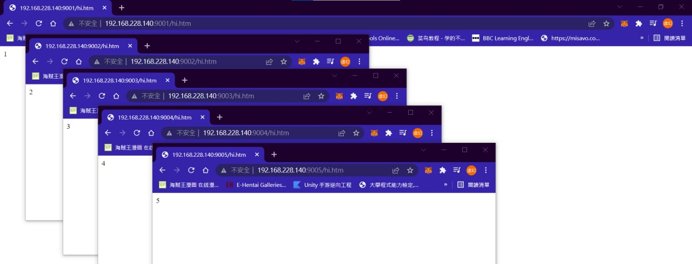
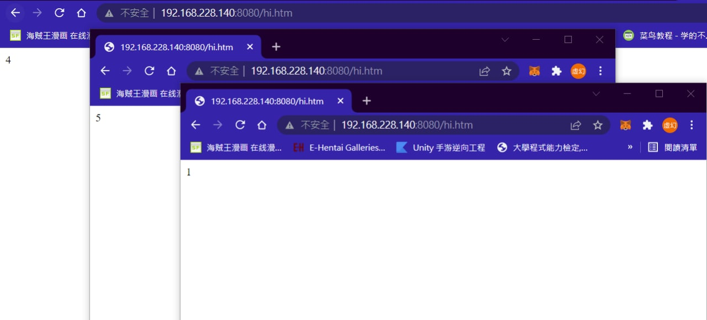

## 用腳本建立多的http伺服器與主機掛載

1. 建立`prepare_web.sh`
```
[root@localhost user]# cat prepare_web.sh
#!/usr/bin/bash

for i in {1..5}
do 
   mkdir -p myweb$i
   cd myweb$i
   echo $i > hi.htm
   cd ..
done 
```
2. 建立`docker_httpd_setup5.sh `
```
[root@localhost user]# cat docker_httpd_setup5.sh 
#! /usr/bin/bash

for i in {1..5};
do
    portno=`expr 9000 + $i`
    docker run -d -p $portno:80 -v /home/user/myweb$i:/usr/local/apache2/htdocs httpd
done
```
3. 執行`prepare_web.sh`和`docker_httpd_setup5.sh `
```
[root@localhost user]# ./prepare_web.sh
[root@localhost user]# systemctl start docker
[root@localhost user]# ./docker_httpd_setup5.sh 
2b98786514ddde68305d711a4192e051ec4348f0c95ef9960e17057c5e39779a
cc465c34380cb447e7c29ddf15780a8486f45f55d8db215dfdbd06ba527758e7
2bd0dac72bb0ef34c120e5a1946e56176f7322d83226939487907c57b08ec092
9b19b5f01cd58c2252dae66e16f5e8ba7e802b45c9ddabe3272f2ad76518fa76
4b0d24c2416845cef631b278d0f707fab625436da966f57d5643af05e0803eaa
```
4. 確認結果


## Dockerfile
1. 建立`Dockerfile`檔案
```
[root@localhost user]# cat Dockerfile
From centos:centos7
RUN yum -y install httpd
EXPOSE 80
ADD index.html /var/www/html
[root@localhost user]# echo "Hello" > index.html
```
1. 執行`docker build -t myhttpd:1.0 .`
```
[root@localhost user]# docker build -t myhttpd:1.0 .
Sending build context to Docker daemon  186.2MB
Step 1/4 : From centos:centos7
centos7: Pulling from library/centos
2d473b07cdd5: Pull complete 
Digest: sha256:c73f515d06b0fa07bb18d8202035e739a494ce760aa73129f60f4bf2bd22b407
Status: Downloaded newer image for centos:centos7
 ---> eeb6ee3f44bd
Step 2/4 : RUN yum -y install httpd
 ---> Running in 8f0b4da61299
Loaded plugins: fastestmirror, ovl
Determining fastest mirrors
 * base: ftp.ksu.edu.tw
 * extras: ftp.ksu.edu.tw
 * updates: mirror01.idc.hinet.net
Resolving Dependencies
--> Running transaction check
---> Package httpd.x86_64 0:2.4.6-97.el7.centos.4 will be installed
--> Processing Dependency: httpd-tools = 2.4.6-97.el7.centos.4 for package: httpd-2.4.6-97.el7.centos.4.x86_64
--> Processing Dependency: system-logos >= 7.92.1-1 for package: httpd-2.4.6-97.el7.centos.4.x86_64
--> Processing Dependency: /etc/mime.types for package: httpd-2.4.6-97.el7.centos.4.x86_64
--> Processing Dependency: libaprutil-1.so.0()(64bit) for package: httpd-2.4.6-97.el7.centos.4.x86_64
--> Processing Dependency: libapr-1.so.0()(64bit) for package: httpd-2.4.6-97.el7.centos.4.x86_64
--> Running transaction check
---> Package apr.x86_64 0:1.4.8-7.el7 will be installed
---> Package apr-util.x86_64 0:1.5.2-6.el7 will be installed
---> Package centos-logos.noarch 0:70.0.6-3.el7.centos will be installed
---> Package httpd-tools.x86_64 0:2.4.6-97.el7.centos.4 will be installed
---> Package mailcap.noarch 0:2.1.41-2.el7 will be installed
--> Finished Dependency Resolution

Dependencies Resolved

================================================================================
 Package           Arch        Version                       Repository    Size
================================================================================
Installing:
 httpd             x86_64      2.4.6-97.el7.centos.4         updates      2.7 M
Installing for dependencies:
 apr               x86_64      1.4.8-7.el7                   base         104 k
 apr-util          x86_64      1.5.2-6.el7                   base          92 k
 centos-logos      noarch      70.0.6-3.el7.centos           base          21 M
 httpd-tools       x86_64      2.4.6-97.el7.centos.4         updates       94 k
 mailcap           noarch      2.1.41-2.el7                  base          31 k

Transaction Summary
================================================================================
Install  1 Package (+5 Dependent packages)

Total download size: 24 M
Installed size: 32 M
Downloading packages:
Public key for httpd-tools-2.4.6-97.el7.centos.4.x86_64.rpm is not installed
Public key for apr-util-1.5.2-6.el7.x86_64.rpm is not installed
warning: /var/cache/yum/x86_64/7/updates/packages/httpd-tools-2.4.6-97.el7.centos.4.x86_64.rpm: Header V3 RSA/SHA256 Signature, key ID f4a80eb5: NOKEY
--------------------------------------------------------------------------------
Total                                              7.4 MB/s |  24 MB  00:03     
Retrieving key from file:///etc/pki/rpm-gpg/RPM-GPG-KEY-CentOS-7
Importing GPG key 0xF4A80EB5:
 Userid     : "CentOS-7 Key (CentOS 7 Official Signing Key) <security@centos.org>"
 Fingerprint: 6341 ab27 53d7 8a78 a7c2 7bb1 24c6 a8a7 f4a8 0eb5
 Package    : centos-release-7-9.2009.0.el7.centos.x86_64 (@CentOS)
 From       : /etc/pki/rpm-gpg/RPM-GPG-KEY-CentOS-7
Running transaction check
Running transaction test
Transaction test succeeded
Running transaction
  Installing : apr-1.4.8-7.el7.x86_64                                       1/6 
  Installing : apr-util-1.5.2-6.el7.x86_64                                  2/6 
  Installing : httpd-tools-2.4.6-97.el7.centos.4.x86_64                     3/6 
  Installing : centos-logos-70.0.6-3.el7.centos.noarch                      4/6 
  Installing : mailcap-2.1.41-2.el7.noarch                                  5/6 
  Installing : httpd-2.4.6-97.el7.centos.4.x86_64                           6/6 
  Verifying  : mailcap-2.1.41-2.el7.noarch                                  1/6 
  Verifying  : apr-1.4.8-7.el7.x86_64                                       2/6 
  Verifying  : apr-util-1.5.2-6.el7.x86_64                                  3/6 
  Verifying  : httpd-2.4.6-97.el7.centos.4.x86_64                           4/6 
  Verifying  : httpd-tools-2.4.6-97.el7.centos.4.x86_64                     5/6 
  Verifying  : centos-logos-70.0.6-3.el7.centos.noarch                      6/6 

Installed:
  httpd.x86_64 0:2.4.6-97.el7.centos.4                                          

Dependency Installed:
  apr.x86_64 0:1.4.8-7.el7                                                      
  apr-util.x86_64 0:1.5.2-6.el7                                                 
  centos-logos.noarch 0:70.0.6-3.el7.centos                                     
  httpd-tools.x86_64 0:2.4.6-97.el7.centos.4                                    
  mailcap.noarch 0:2.1.41-2.el7                                                 

Complete!
Removing intermediate container 8f0b4da61299
 ---> 9e7712b2e22f
Step 3/4 : EXPOSE 80
 ---> Running in afadcac4b386
Removing intermediate container afadcac4b386
 ---> 891942151305
Step 4/4 : ADD index.html /var/www/html
 ---> 7ba675f56530
Successfully built 7ba675f56530
Successfully tagged myhttpd:1.0
[root@localhost user]# 
```

2. `docker images`確認`myhttpd:1.0`已經建立
```
[root@localhost user]# docker images
REPOSITORY    TAG       IMAGE ID       CREATED          SIZE
myhttpd       1.0       7ba675f56530   54 seconds ago   397MB
ubuntu        v1        2ee7c61e64c6   13 hours ago     72.8MB
httpd         latest    faed93b28859   2 weeks ago      144MB
ubuntu        latest    54c9d81cbb44   6 weeks ago      72.8MB
hello-world   latest    feb5d9fea6a5   5 months ago     13.3kB
centos        centos7   eeb6ee3f44bd   6 months ago     204MB
[root@localhost user]# docker run -d -p 8888:80 myhttpd:1.0  /usr/sbin/apachectl -DFOREGROUND
```

## docker haproxy
1. 
```
[root@localhost user]# gedit haproxy.cfg
```
```
defaults
  mode http
  timeout client 10s
  timeout connect 5s
  timeout server 10s
  timeout http-request 10s

frontend myfrontend
  bind 0.0.0.0:8080
  default_backend myservers

backend myservers
  balance roundrobin
  server server1 192.168.56.113:9001
  server server2 192.168.56.113:9002
  server server3 192.168.56.113:9003
  server server4 192.168.56.113:9004
  server server5 192.168.56.113:9005
```
2. 執行`docker run -p 8080:8080  -d --name haproxy-master -v /home/user/haproxy.cfg:/usr/local/etc/haproxy/haproxy.cfg --privileged=true haproxy`
```
[root@localhost user]# docker run -p 8080:8080  -d --name haproxy-master -v /home/user/haproxy.cfg:/usr/local/etc/haproxy/haproxy.cfg --privileged=true haproxy
df5447cc3978605df9cfa1cbf0f924546f68c8389c4306b2fee66278ef5dc9d8
```

3. 確認結果

## awk
```
[root@localhost user]# cat process.awk 
BEGIN{
  sum=0;
  i=0;
}
{
  sum+=$3;
  i++;
}
 
END { 
  printf("總和為:%d\n", sum);
  printf("average=%.2f\n", sum/i);
}
[root@localhost user]# awk -f process.awk  file1
總和為:313
average=62.60
```