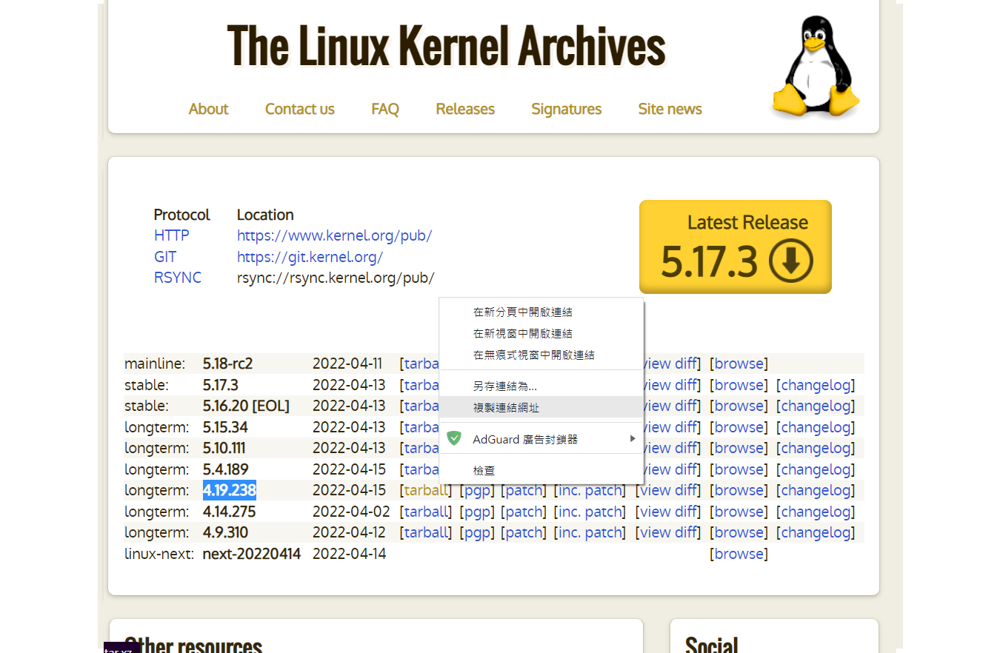

## 編譯不同版本的核心
這項實驗需要較大的硬體空間，建議準備30G以上的虛擬機

參考網站 -- [RHEL / CentOS 7 編譯核心](https://www.ltsplus.com/linux/rhel-centos-7-compile-kernel)
1. 確認使用的版本
```
[root@localhost user]# uname -r
3.10.0-1160.59.1.el7.x86_64
```
2. 安裝所需工具
```
yum update
yum install -y ncurses-devel make gcc bc bison flex elfutils-libelf-devel openssl-devel grub2
```
3. 到kernel網站，選擇`4.19.238`的版本，右鍵複製`tarball`的鏈接


4. 打開虛擬機使用`wget + 鏈接`下載檔案，注意虛擬機必須連網

5. 解壓縮檔案

6. 從`/boot/`複製`config-版本名稱`的檔案到解壓縮的檔案下，改名為`.config

7. 執行`make menuconfig`會跳出圖形化介面，按`save`和`exit`

8. 依序執行`make bzImage`、`make modules`、`make`、`makem odules_install`、`make install`，注意此過程執行時間較長。如果發生錯誤執行`make clean`後再執行發生錯誤的步驟

9. 完成後重啟系統
## jumpserver

### 安裝docker compose
參考網站 -- [Install Docker Compose](https://docs.docker.com/compose/install/)

1. 下載`docker-compose`  
```
[root@localhost user]# curl -L "https://github.com/docker/compose/releases/download/1.29.2/docker-compose-$(uname -s)-$(uname -m)" -o /usr/local/bin/docker-compose
% Total    % Received % Xferd  Average Speed   Time    Time     Time  Current
                                 Dload  Upload   Total   Spent    Left  Speed
100   664  100   664    0     0   1098      0 --:--:-- --:--:-- --:--:--  1099
100 12.1M  100 12.1M    0     0  3633k      0  0:00:03  0:00:03 --:--:-- 4656k
```
2. 將`/usr/local/bin/docker-compose`設為可執行檔
```
[root@localhost user]# chmod +x /usr/local/bin/docker-compose
```
3. 確認安裝`docker-compose`
```
[root@localhost user]# docker-compose --version
docker-compose version 1.29.2, build 5becea4c
```
### Jumpserver
參考網站 -- [Jumpserver Docker-Compose](https://github.com/jumpserver/Dockerfile)
1. 從github上下載檔案
```
[root@localhost /]# git clone --depth=1 https://github.com/wojiushixiaobai/Dockerfile.git
Cloning into 'Dockerfile'...
remote: Enumerating objects: 39, done.
remote: Counting objects: 100% (39/39), done.
remote: Compressing objects: 100% (36/36), done.
remote: Total 39 (delta 9), reused 13 (delta 0), pack-reused 0
Unpacking objects: 100% (39/39), done.
```
2. 進入`Dockerfile`目錄，複製`config_example.conf`為`.env`
```
[root@localhost /]# cd Dockerfile/
[root@localhost Dockerfile]# cp config_example.conf .env
```
3. 編輯`.env`，`DOCKER_SUBNET`欄位設為`172.20.0.0/16`
```
[root@localhost Dockerfile]# cat .env
# 版本号可以自己根据项目的版本修改
Version=v2.20.3

# 构建参数, 支持 amd64/arm64
TARGETARCH=amd64

# Compose
COMPOSE_PROJECT_NAME=jms
COMPOSE_HTTP_TIMEOUT=3600
DOCKER_CLIENT_TIMEOUT=3600
DOCKER_SUBNET=172.20.0.0/16

# 持久化存储
VOLUME_DIR=/opt/jumpserver

# MySQL
DB_HOST=mysql
DB_PORT=3306
DB_USER=root
DB_PASSWORD=nu4x599Wq7u0Bn8EABh3J91G
DB_NAME=jumpserver

# Redis
REDIS_HOST=redis
REDIS_PORT=6379
REDIS_PASSWORD=8URXPL2x3HZMi7xoGTdk3Upj

# Core
SECRET_KEY=B3f2w8P2PfxIAS7s4URrD9YmSbtqX4vXdPUL217kL9XPUOWrmy
BOOTSTRAP_TOKEN=7Q11Vz6R2J6BLAdO
DEBUG=FALSE
LOG_LEVEL=ERROR
```
4. 開始部屬，注意第一次部屬時間較長，如果部屬失敗，用`docker -ps`查看，把剛建立的容器刪掉，多試幾次總會成功
```
bash: [root@localhost: command not found...
[root@localhost Dockerfile]# docker-compose -f docker-compose-redis.yml -f docker-compose-mariadb.yml -f docker-compose.yml up
Creating jms_redis ... done
Creating jms_mysql ... done
Creating jms_core  ... done
Creating jms_lion   ... done
Creating jms_koko   ... done
Creating jms_web    ... done
Creating jms_celery ... done
```
5. 開啟網頁確認部屬成功
   