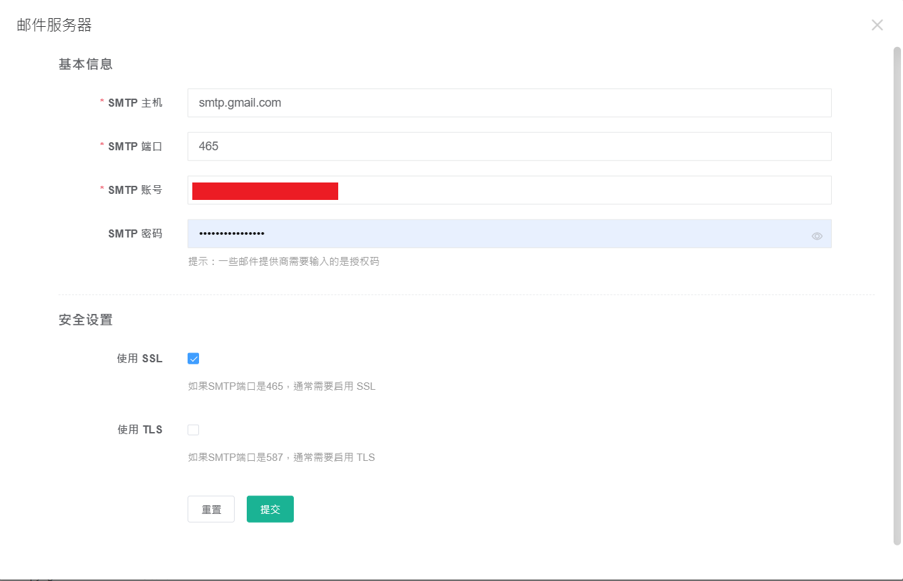

## jumpserver STMP google寄信
1. 取得gmail的應用程式密嗎
參考網站 -- [【2021最新版】如何使用Google SMTP寄信(兩段式驗證+應用程式密碼) - 主機架站寄信教學](https://www.webdesigntooler.com/google-smtp-send-mail)

2. 登陸jumpserver，點選右上角的系統設置，左邊的郵件設置
   

3. 郵件服務器根據下表的格式填
```
SMTP host：smtp.gmail.com
SMTP port：465
SMTP security mode：SSL/TLS

SMTP authentication：yes

SMTP account： [gmail信箱]

SMTP password：[google應用程式密碼]
```

注意：郵件服務器的SMTP帳號與發件人需一致
