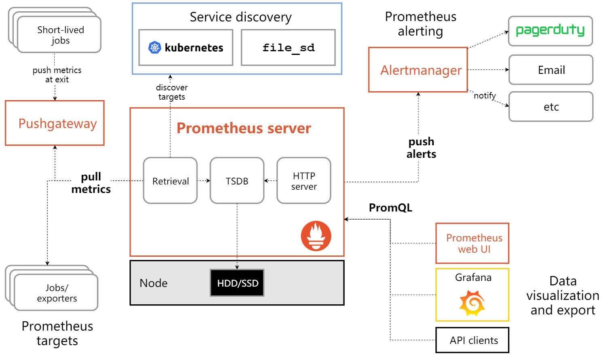
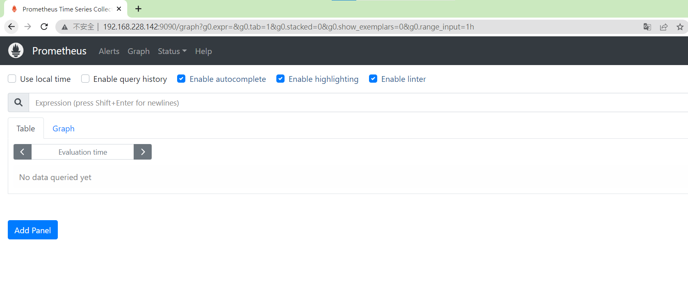
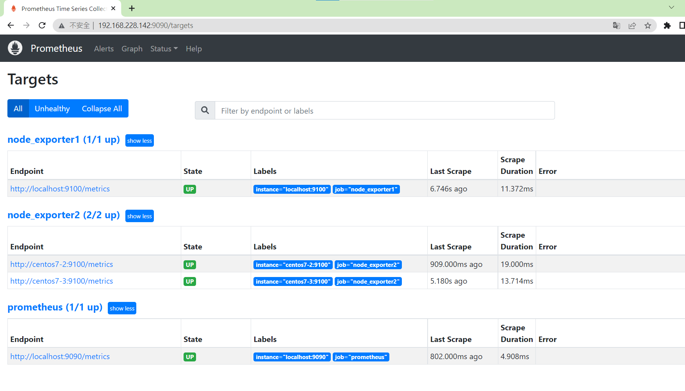

## 修改機器名稱
修改後沒變的話再重登一次root
```
[root@localhost user]# hostnamectl set-hostname centos7-1
[root@localhost user]# exit
exit
[user@localhost ~]$ su
Password: 
[root@centos7-1 user]# 
```
## 綁定ip

## 記憶體配置
2GB 
2核心

## 可設置ssh無密碼登錄之後會更方便操作
ssh-keygen
ssh-copy-id user@hostname

## 專業術語
集縮比：如果一條線路的頻寬為2M，給一個使用者用，集縮比為1：1，給４個人使用集縮比為1：4  
創意與回饋
penetration test：  
core/aggregate(匯聚層)：把管道集合到core  

HA：高可用  
cluster：集群  
single point failure：  
過去的架構  
網路架構中的迴圈會有廣播風暴可透過STP演算法  
但會出現不用的線路造成資源浪費

stacking： 邏輯上把同層機器整合成一台機器，在管理上更方便  

## Prometheus
參考網站 -- [prometheus](https://prometheus.io/download/)、[Prometheus学习](https://www.codeleading.com/article/10525895320/)
## 架構圖



1. 使用wget下載prometheus壓縮檔  
```
[root@centos7-1 Downloads]# wget https://github.com/prometheus/prometheus/releases/download/v2.35.0/prometheus-2.35.0.linux-amd64.tar.gz
```
2. 解壓縮到`/opt/module`下，如果沒有目錄就建一個
```
[root@centos7-1 user]# mkdir /opt/module/
[root@centos7-1 Downloads]# tar xf prometheus-2.35.0.linux-amd64.tar.gz -C /opt/module/ 
[root@centos7-1 prometheus-2.35.0.linux-amd64]# chown -R root /opt/module/prometheus-2.35.0.linux-amd64
```
3. 改名`prometheus-2.35.0.linux-amd64/`為`prometheus`
```
[root@centos7-1 module]# mv prometheus-2.35.0.linux-amd64/ prometheus
[root@centos7-1 module]# ls
prometheus
```
4. 到`/usr/lib/systemd/system/`下，新建一個`prometheus.service`，讓我們能用`systemctl`啟動`prometheus`
```
[root@centos7-1 Downloads]# cd /usr/lib/systemd/system/
[root@centos7-1 system]# cat prometheus.service 
[Unit]
Description=Prometheus
After=network-online.target

[Service]
Type=simple
Restart=on-failure
ExecStart=/opt/module/prometheus/prometheus --config.file=/opt/module/prometheus/prometheus.yml --storage.tsdb.path=/opt/module/prometheus/data --storage.tsdb.retention=30d --web.enable-lifecycle --log.level=debug

[Install]
WantedBy=multi-user.targe
```
5. 啟動`prometheus`
```
[root@centos7-1 system]# systemctl daemon-reload
[root@centos7-1 module]# systemctl start prometheus
[root@centos7-1 module]# systemctl status prometheus
● prometheus.service - Prometheus
   Loaded: loaded (/usr/lib/systemd/system/prometheus.service; disabled; vendor preset: disabled)
   Active: active (running) since Tue 2022-04-26 20:38:29 PDT; 4s ago
 Main PID: 4150 (prometheus)
    Tasks: 9
   CGroup: /system.slice/prometheus.service
           └─4150 /opt/module/prometheus/prometheus --config.file=/opt/module/promet...

```
6. 查看9090號port

## node_exporter
1. 下載步驟和Prometheus一樣  

2. 到`/usr/lib/systemd/system/`下，新建一個`node_exporter.service`
```
[root@centos7-1 Downloads]# cd /usr/lib/systemd/system/
[root@centos7-1 ~]# cat /usr/lib/systemd/system/node_exporter.service 
[Unit]
Description=node_exporter
Documentation=https://github.com/prometheus/node_exporter
After=network.target
 
[Service]
Type=simple
ExecStart=/opt/module/node_exporter/node_exporter
Restart=on-failure

[Install]
WantedBy=multi-user.target
```
3. 在`centos7-2`和`centos7-3`中都下載`node_exporter`  

4. 修改`/opt/module/prometheus/prometheus.yml`的配置如下
```
  - job_name: 'node_exporter1'
    static_configs:
    - targets: ['localhost:9100']

  - job_name: 'node_exporter2'
    static_configs:
    - targets: ['centos7-2:9100', 'centos7-3:9100']
```
5. 查看`prometheus`的target頁面  

