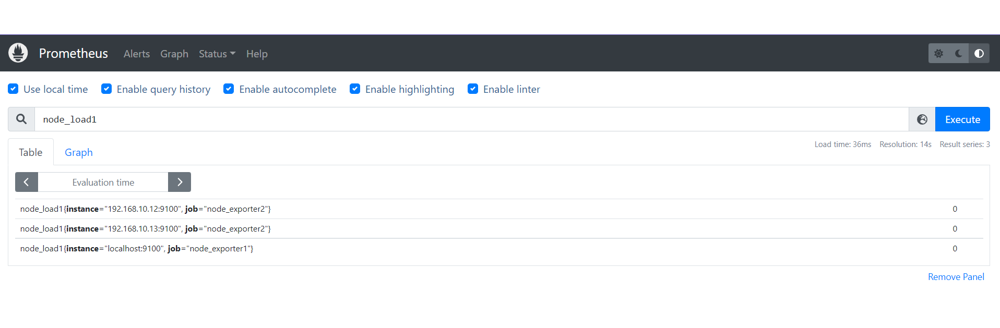

## 指令

## node_load1

## node_load1{instance="192.168.10.12:9100"}[1m]

## node_load1{instance="192.168.10.12:9100"}[1m] offset 5m


## increase(node_cpu_seconds_total{mode="idle"}[5m])


## grafana
參考網站 -- [在 CentOS 7 上安裝 Grafana 6.0.2](http://max043.blogspot.com/2019/03/centos-7-grafana-602.html)

1. 新增`grafana.repo `
```
root@centos7-1 user]# cat /etc/yum.repos.d/grafana.repo 
[grafana]
name = grafana
baseurl = https://packages.grafana.com/oss/rpm
repo_gpgcheck = 1
enabled = 1
gpgcheck = 1
gpgkey = http://packages.grafana.com/gpg.key
sslverify = 1
sslcacert = /etc/pki/tls/certs/ca-bundle.crt

```

2. 安裝
```
root@centos7-1 user]# yum install -y grafana
```

3. 啟動
```
root@centos7-1 user]# systemctl daemon-reload
root@centos7-1 user]# systemctl start grafana-server
```
4. 在`ip:3000`查看頁面


5. 選擇左邊欄位的齒輪圖案，點選`Add data source`，選擇`Promethus`

6. 在`url`輸入`Promethus`的網址，拉到下面點選`Save&Test`，出現綠色勾勾代表成功


## 匯入模板
[模板網址](https://grafana.com/grafana/dashboards/?dataSource=prometheus)
1. 複製右方的ID

2. 選擇+字圖案，輸入剛才的ID，點選`load`

3. 在最下方欄位選擇剛建立的`Promethus`，點選`Import`

4. 查看頁面
