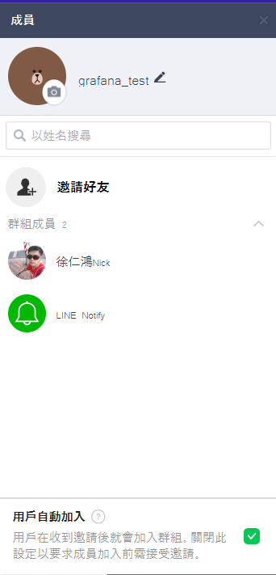
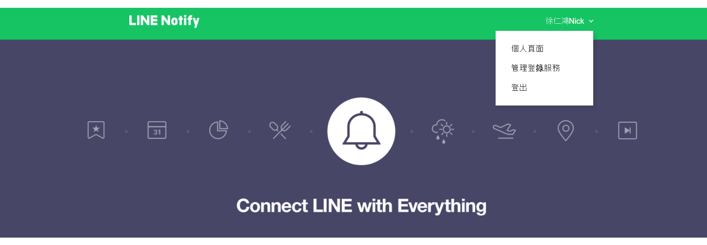
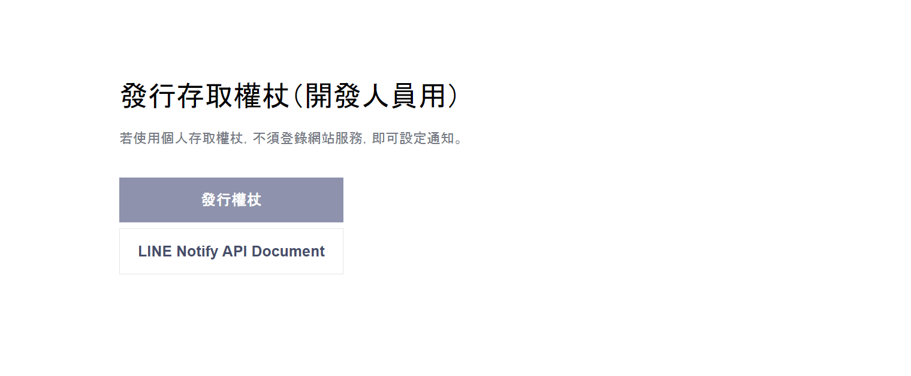
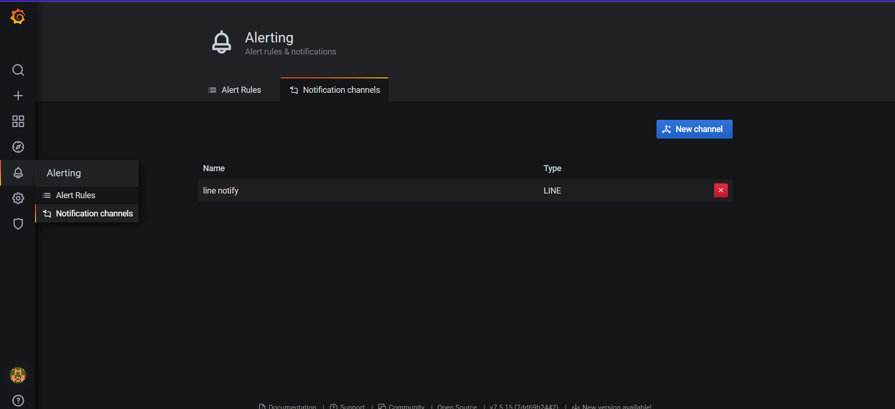
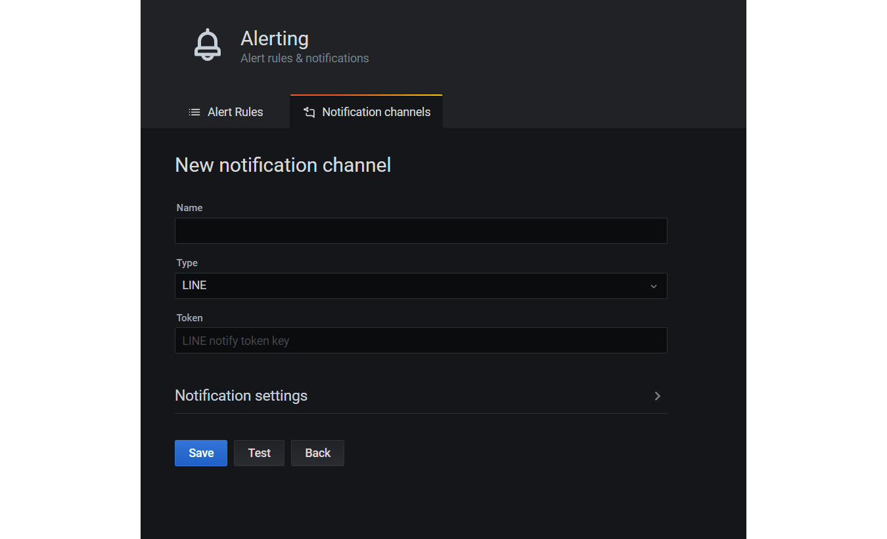
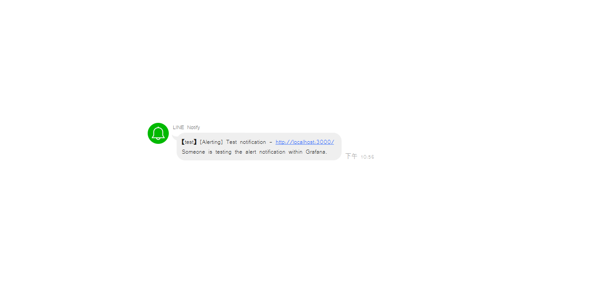
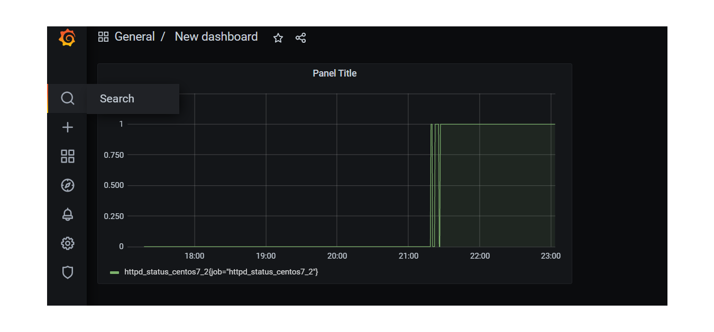
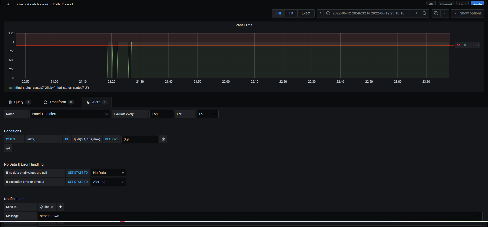
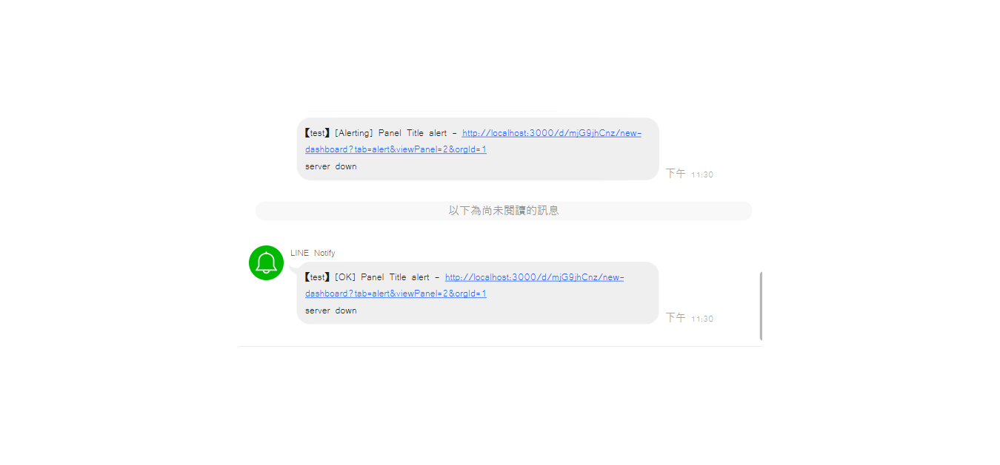

## grafana與linebot警報
1. 選擇`create/Add panel`   

2. 輸入`httpd_status_centos7_2`  

3. 建立一個新的line群組，把Line Notify加入群組  

4. 到[line notify](https://notify-bot.line.me/zh_TW/)個人頁面選擇發行權杖，選擇你的群組，發行權杖後複製下來

5. 回到`grafana`，選擇`alert`,點選`new channel`

6. 名稱自取，`type`選擇line，`token`貼上權杖，點選`save`，`test`，成功的話群組內的line notify會跳出類似訊息

   
7. 到`search`選擇剛才建立的`httpd_status_centos7_2`面板，點選面板上方的`Panel Title`選擇`Edit`

8. 選擇`alert`，設定如下圖，`send to`選擇剛才建立的`line`，`message`隨意輸入 

9. 儲存成功後，開關httpd，確認是否會跳出類似訊息  
